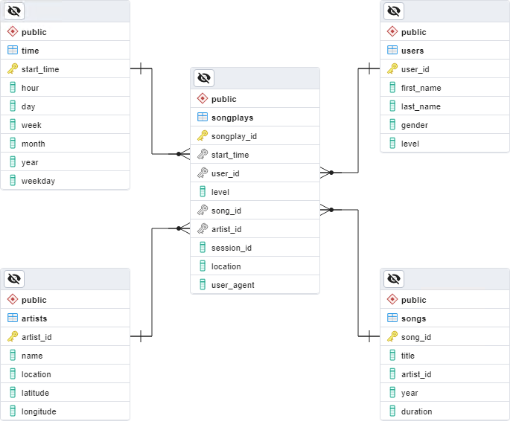

# Udacity Project: Data Modeling with PostgresSQL

## Introduction

A startup called Sparkify has hired me as a data engineer to create a database using PostgresSQL to help them optimize queries for their song play analysis. I have been tasked with creating a Star database schema and developing ETL pipelines to create the tables, populate them with data and query for results. Data has been provided in JSON files for song_data and log_data from which I'm to extract the information and push into the database for analysis.

## Description

We were provided with several Python code file and Juypter Notebeek template files for this project. These were used to create the SQL queries and to create/test Python code.
- sql_queries.py:   Placeholder query names for create database, drop tables, create tables, and select queries.
- create_tables.py: Python code to execute the creation of the database and tables using the SQL in sql_queries.py.
- test.ipynb:       Test code to query the Postgres tables to validate columns and data.
- etl.ipynb:        Notebook to guide us through creating the Python code that would execute queries and load tables.
- etl.py:           Python code file for completed ETL code.
- README.md:        Blank readme file to document solution.

### Files added:
- requirements.txt: Used pip3 freeze > requirements.txt to lock code library's and populate the file.
- sparkifydb_erd.png:   Screenshot of ERD created in pgAdmin4.

## Requirements

Project was created in Visual Studio Code (v1.79.2) using an Anaconda virtual environment. An installation of Postgres (v7.2) is available on the localhost.
Please refer to the requirements.txt file for all Python library versions used in this project.

## Database Design

Temporary dataframes were utilized to import sample data from the JSON files in order to visualize the data structures. From this analysis, tables were designed and created using SQL queries located in the sql_queryies.py file. Execution of the code in the create_tables.py file will drop the sparkifydb (if exists) and create the required tables.

The below Entity Relationship Diagram was generated in pgAdmin4 and is included in the sparkifydb_erd.png file.

## ETL Pipeline

To create the ETL process, the etl.ipynb (Jupyter Notebook) was written and tested so results could be visualized. When all test code had been executed, the test.ipynb notebook was ran to validate that all tables had data. Finally, code in the etl.py file is executed to populate the tables from the data contained in the JSON files. A final run of test.ipynb confirmed that all tables were populated with data. 

To run the ETL process, execute the following queries in the order specified:
1. Run create_tables.py
2. Run etl.py
3. Run test.ipynb (to validate results)